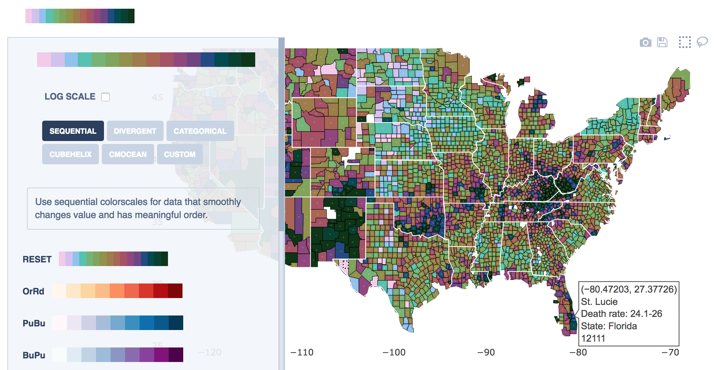

# dash-colorscales 🌈

Add a fancy colorscale picker to your Dash apps. `DashColorscales` wraps [react-colorscales](https://github.com/plotly/react-colorscales) for use in Dash.

👉 [Simple demo](http://react-colorscales.getforge.io/)

👉 [Advanced demo](https://opioid-epidemic.herokuapp.com/) [(code)](https://github.com/plotly/dash-opioid-epidemic-demo)



## Dash

Go to this link to learn about [Dash](https://plot.ly/dash/).

## Getting started

```sh
pip install dash_colorscales
```

## Usage

```
import dash_colorscales
import dash
import dash_html_components as html
import json

app = dash.Dash('')

app.scripts.config.serve_locally = True

app.layout = html.Div([
    dash_colorscales.DashColorscales(
        id='colorscale-picker',
        nSwatches=7,
        fixSwatches=True
    ),
    html.P(id='output', children='')
])

@app.callback(
        dash.dependencies.Output('output', 'children'),
        [dash.dependencies.Input('colorscale-picker', 'colorscale')])
def display_output(colorscale):
    return json.dumps(colorscale)

if __name__ == '__main__':
    app.run_server(debug=True)
```

## API

The `DashColorscales` component accepts these optional properties:

| `prop`         | Description                                                                                  | 
| -------------- | -------------------------------------------------------------------------------------------- |
| `id`           | Optional: Identifier used to reference component in callbacks                                |
| `colorscale`   | Optional: Default colorscale as an array of color strings (HEX or RGB). Defaults to viridis. |
| `nSwatches`    | Optional: Number of discrete colors or "swatches" in the default color scale.                |
| `fixSwatches`  | Optional: If set to `True`, hides the swatches slider and fixes swatches to `nSwatches`.     |

